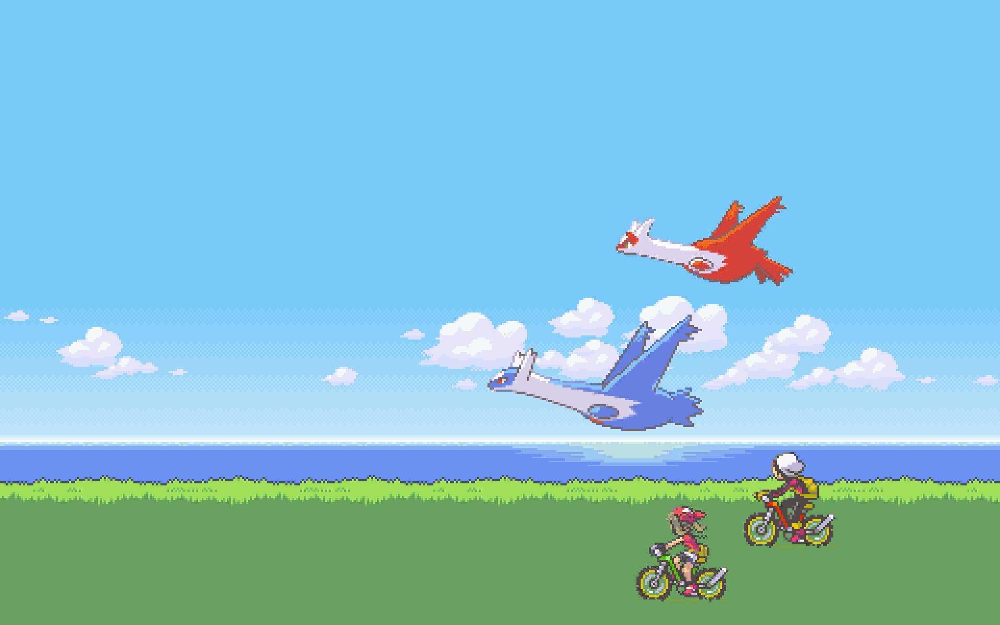

<h1>Entry 1: Gosu</h1>

## Decinding on my topic

There are so many interesting topics that I could possibly study for my independent study, that it was hard for me to only choose one. An example would be Swift - a programming language for macOs, iOS, watchOS and tvOS. I have always wanted to build an app on my iphone, so it'd be perfect if I were to study Swift, but I couldn't. Because Swift requires Xcode, something that only works on MacOs, I can only rent a mac with remote screen connected to my window to code using Swift, which is something that I do not want to do. Another interesting topic would be Cyber Security. For years, I have only looked into programming languages that allow you to create application, webpage, etc., but I realized the importance of security for the application, webpage, etc., so I found Cyber Security interesting to study. Although it'd interesting to study Cyber Security, but I can't think of anything other than a tutorial to create with Cyber Security. After several researches, I decided to study Gosu because games like snake and pokemon, which are 2D games, remain me of my childhood games.

## What is Gosu?

Gosu is a programming language that allows the programmer to create two-dimensional games, such as snake and mario. It is implemented as a gem that is compatible with Ruby.

## Next Step
- Grasp the concepts of Gosu by doing the tutorials.
- Think about what I want to make using Gosu.
