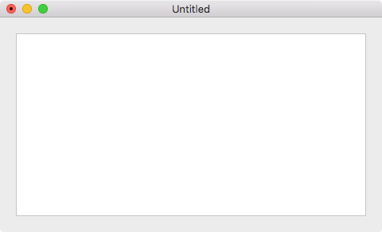
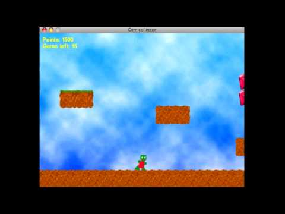

# Entry 2: Getting into Gosu

## Basic concepts of Gosu

### Creating a window using Gosu
The essential part of Gosu is the subclass that uses inheritance - Gosu:Window. This subclass allows one to create a specific window with one's desired pixel size, ex. one could create a 500x500 pixel-sized window when the window is initialized.

### Update and Draw
Similar to P5js's function setup and draw that call the functions, Gosu also relays on calling the methods. Although initializing the window would only be called once everytime a new Gosu class is defined, update and draw constantly overrides the current method 60 times per second. While update and draw both override the method, they work a little bit differently. Update always overrides the previous method, but draw may not override the previous method due to performance issues. Also, unlike draw, update is where the game logic, such as moving objects around and testing for collision, belongs because it always overrides the method.

### Show
Show is another essential concept of Gosu that cannot be forget. A program with Gosu might be brilliant and amazing, but it would not work without the show method. It is a simple way to display the window that has been initialized in the class.

## Simple Game Logics

### Formulas
Sometimes Gosu requires formulas just like other languages. In the case of the Gosu tutorial, a formula related to sine and cosine is used to calculate the acceleration when the player moves the avatar, in this case would be the spaceship.

### Relation to the x and y coordinates 
The x and y coordinates are important when it comes to moving the objects. The Gosu Tutorial includes offsets for the x and the y coordinates when acceleration is applied to the moving object.

## Gosu Default Implementations

### Toggle between fullscreen and the set window size
Gosu allows users to switch between fullscreen and window mode by toggling alt+enter. This is implemented using the `GOSU:Window#button_down`.

### Overriding button_down
One could modify the method button_down to fulfill the game logic. Let's say the user is holding down left, then you want the avatar to move towards left. This condition is fulfilled by modifying the method.

## Takeaways
- Although some concepts might be difficult to understand, you need to know that there are many other resources out there that you could possibly use to strengthen your understanding about a concept. For example, the acceleration for the spaceship was hard to understand since there was not much explanation for it. But I was able to understand it by looking into other resources such as videos about making a bat game using Gosu.
-Things might not always work out, but don't give up on the problem/issue.

## Next Step
- While I have been digging into the concepts of Gosu from the tutorials and videos, and learned a lot from those. I have not yet created or tested anything myself because I could not succeed in installing neither the Gosu-Examples gem nor the original Gosu gem. Although I have looked into the issue/error code on Google, I have yet to find a solution to the issue. Judging from what I found on Google, people mention the compatibility of Gosu with newly updated Ruby and the companion gems that Gosu requires in order to work. Hopefully I can get it to work next week so I can test things out myself.
