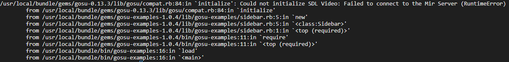
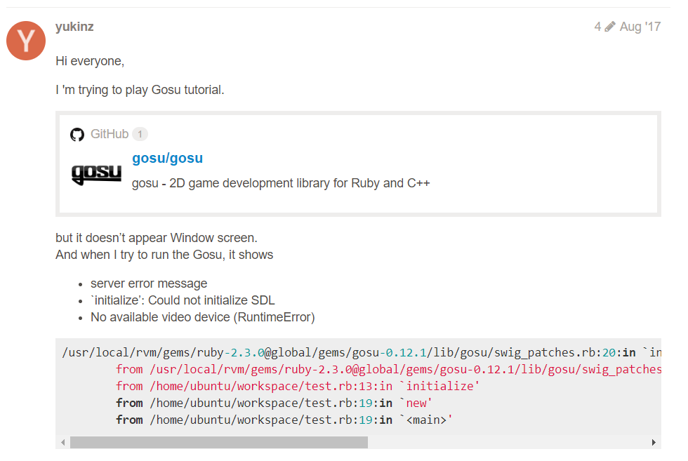
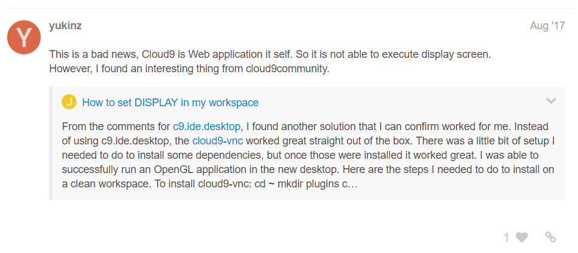
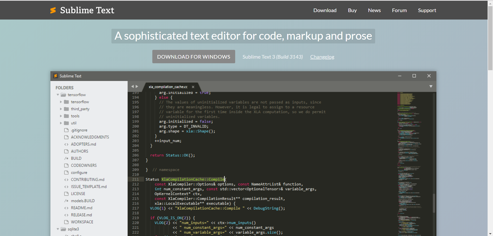
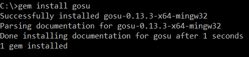
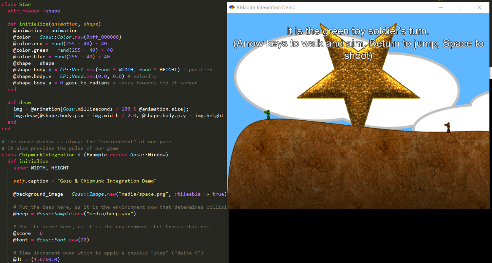
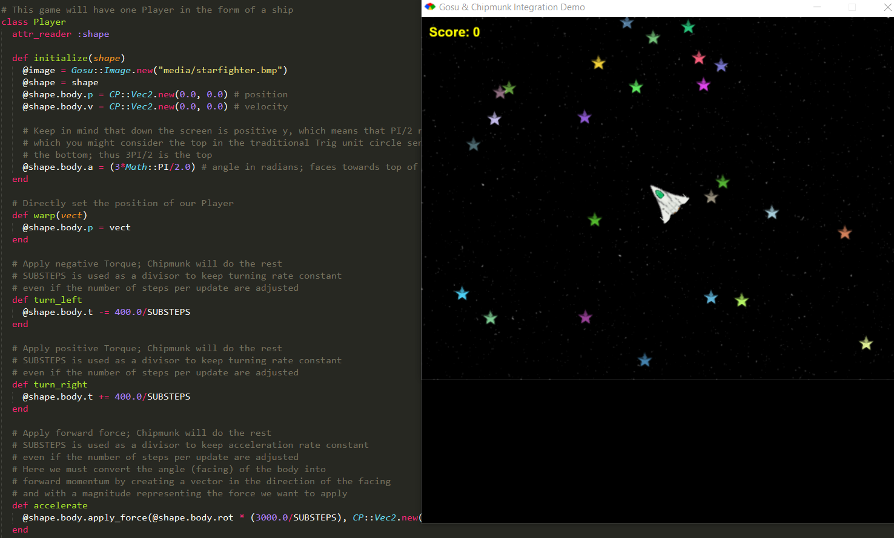
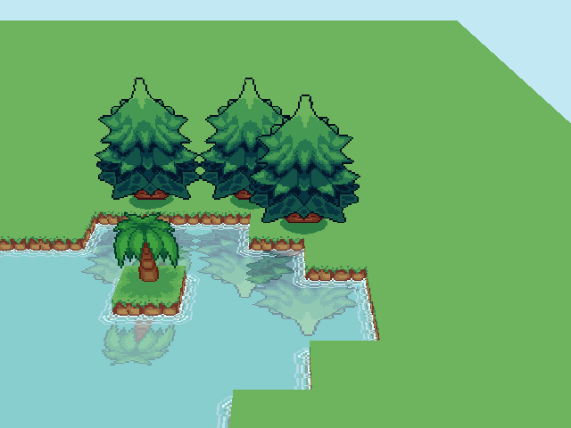

# Entry 4: Installing Gems and Tinkering
I spent half of week 4 trying to install `gosu` and its fellow gems, and succeed in the installation. And it was just pure tinkering after that.

### Web IDE
Starting off my independent study, I used web IDEs, Integrated Development Environments such as Cloud9 and Codenvy, because I found the user interface an easy and convenient way to manage the files; also, web IDEs allow user to switch between multiple devices with different operating systems. But it was a mistake because it made me went through a lot of troubles just to install the `gosu` gem.

Although there were many issues, one led to another, I thought everything would work out if I had the `gosu` dependencies installed. But it was not the case. After I successfully installed the `gosu` dependencies required for a linux operating system like Ubuntu, which is exactly what Cloud9 and Codenvy use, and the `gosu` gem, things did not work out as I expected. 

Apparently web IDEs such as Cloud9 and Codenvy do not support display screen by default. The display screen is the essential part of 2D game development for `gosu`. `gosu` does not function without a display screen.

An image of the display screen error below.



After looking through threads, I found someone who had the same problem with `gosu` display screen on the cloud9 community.





At this point, I figured that it would be easier to use my own windows operating system to install `gosu` and other gems such as `rmagick`, `chipmunk`, and `opengl`.

### Terminal and Editor
The solution was not as complicated as I thought. Because my windows opearting system already has its own terminal/command line, the only tool that I need was the editor. And then I found this amazing editor - Sublime Text.



### Gems
Since the way to install `gosu` is completely different on a windows operating system than macOS and Linux, it was extremely easy for me to install `gosu` using my windows terminal. All I need to do was install `Ruby` and `rubyGems` then  `gem install gosu` in the terminal. 



Other than the main `gosu` gem, I also had to install mutliple libraries for additional usages.

```bash
gem install chipmunk
gem install rmagick
gem install opengl
```

While `chipmunk` and `opengl` were installed without any issue, I had to look into details to install `rmagick`.

```bash
path=c:\path to ImageMagick\ImageMagick-6.7.9-Q8;%path%
```

`ImageMagick` is required to install `rmagick` gem. Thus, I installed `ImageMagick` to a path without any space(the most important step), and I set the path of `ImageMagick` prior to the window's default path, and checked the installation with `convert -v`. Lastly I had to gem install `rmagick` with the path to ImageMagick.

```bash
gem install rmagick -- '--with-opt-dir="[path to ImageMagick]"
```
### Tinkering
Now that I'm done installing the gems that are needed to tinker with the `gosu` examples, I can begin messing around with the files.

Example using `rmagick`



Example using `chipmunk`



`Opengl` is used to create maps and rendering 2D/3D graphics.




## Takeaways
- **A problem and the solution to it might not be as complicated as you think.** Honestly, I feel like I wasted my time on extra works for no reason. I did not have to spend weeks searching for the solutions to the chain of problems, but it was kinda a must because I had no prior knowledge about this simple solution to install `gosu`. And even if I did know about it, I would probably still try to use web IDEs to install `gosu` because of its convenience and the issue with multiple devices when you use your own window terminal.
- **Always make sure that you follow the right instruction and always test things out.** When reading a thread, comment, or offical instruction, make sure you read every single line carefully. Do not skip the instruction beecause every line is important for you to accomplish what you want.

## Next Step
- Although I have sucessfully installed `gosu` and begin tinkering with the examples. I am pretty late on schedule, thus, I need to focus and learn about `opengl`,`rmagick`, and `chipmunk` at a fast pace next week. 