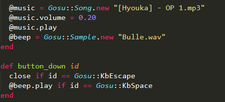
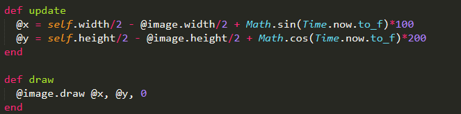
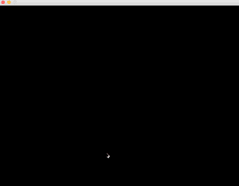
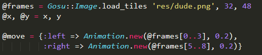

# Entry 5: Thinking What to Make
I spent week 5 thinking about what game to make using `gosu`. Thus, I spent time to try out different components of basic Gosu::Window  that I could utilize in any game that I will create in the future week. 

### Sound and Sample
With the basic `gosu` components,  I am able to variety of stuffs - including moving string with sine and cosine formula, background music, sound effect, etc. 

Sound and Sample are the unique ways to call background music and sound effect in `gosu`. While sounds are longer and could possibly be looping, usually songs are considered sounds, samples are the sound effects that play when a certain button is pressed while the `Gosu::Window` is running.

In this case (the pic below), the sound would be the song: [Hyouka] - OP 1 and the sample would be the sound effect: Bulle. The song starts playing right after the `Gosu::Window` is called, and the sound effect only triggers when the user presses space while the `Gosu::Window` is running. 

A game would be boring without Sound and Sample, thus, I must include at least one for each in my game. It's a must.

### Coordinate and String Animation
The ruby gem/library `gosu` is very similar to `p5js` in multiple aspects. One of which is their indication of a coordinate. Both `p5js` and `gosu` treat the coordinate provided as the upper-left of either an image, a string, a shape, or other elements.

The image above shows both the location of the spaceship and the coordinate of the spaceship. As you can see, the red dot indicates the coordinate that the spaceship current being drawed at, which is the upper-left of the image of the spaceship.

Formulas such as sine and cosine are essential when it comes to string animation in `gosu`. And this is where `update` and `draw` shine. By updating the x coordinate of the string with sine and the y coordinate with cosine, it allows the string to look like it is shifting upwards, downwards, towards left and towards right; though, the coordinate of the string is just being updated and the string being drawed 60 times in a second. 

The image below shows an image being drawed with different coordinates.

### Character/Avatar Animation
Just like how one could implement image and string animation with formulas like sine and cosine, one could also implement animation of moving avatar using a different method, by utilizing the sprite sheets.

Here an example of a sprite sheet.

As you can see that the single png file includes multiple individual artwork of motions. Similar to an array, the first individual artwork has an index of `0`. With the order of index in mind, I used `Gosu::Image` to indicate the sprite sheet and give the corresponding motions when the avatar moves left and right.

The result of the above code looks something like the image below.

Is it also possible to have the following animation effects by using sprite sheet. Isn't it awesome?

### Coming up with Ideas
- I thought I could make games that I have made differently in other languages like `p5js`. A maze game like the one that I made with `p5js` might be nice to see in Ruby `gosu`, because I can do a lot more with the `gosu` library and other gems than what I could with `p5js`.
- A competitive two players shooting game sounds appealing and interesting. The battle takes place in space with two spaceships, one tries to shoot down the other, and the last one standing is the winner. (Most challenging on the list)
- A 2D running game with obstacles coming right into your face. The purpose is try to stay alive for as long as possible, high score based. The player starts with three or more health points, and the health point decreases by one whenever the avatar is hit by an obstacle; also, the player loses if the health point hits zero. 

For now, I will stick with the 2D running game unless I change my mind while coding the 2D running game.

## Takeaways
- **There might be many options to what to make, but it is the best to go steadily than hit yourself with more difficult challenges.** I thought it would be most appropriate to start with something easy and see how it goes. Just like when one is building a car, you can't challenge yourself to make a car when you don't know how to make a skateboard.

## Next Step
- I will continue coding the 2D running game. I will definitely encounter issues and problems while coding, and I will learn more about `gosu` from these issues and challenges.