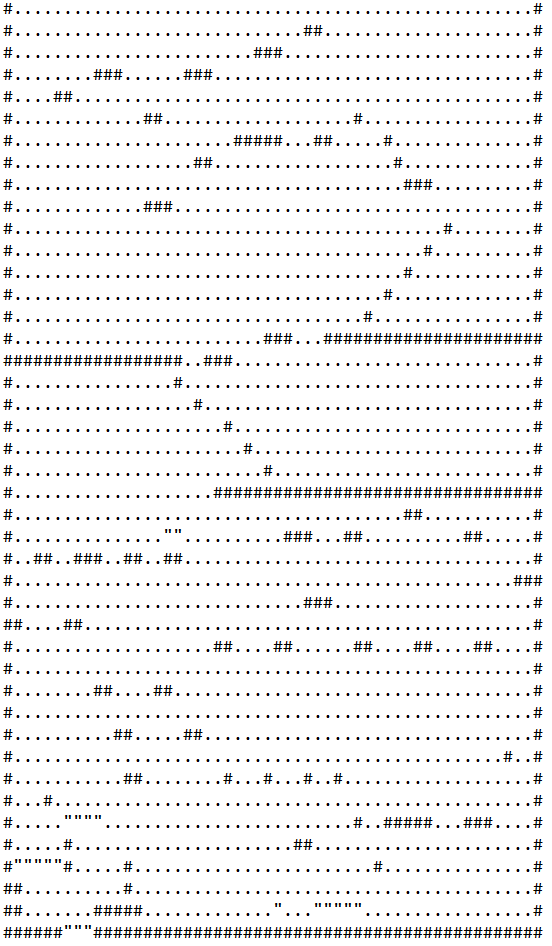
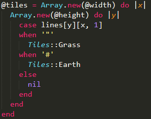
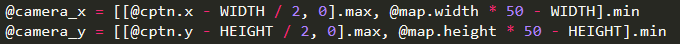
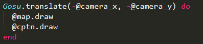

# Entry 6: Working on MVP
Since I have decided on what to make, the parkour game, I am ready to continue to work on my independent-study project. 

### Constructing a map 
A parkour map is the essential factor for a parkour game. Therefore, it is extremely important for me to comprehend and fully grasp the concept of making a map. 

There are many ways to construct a map for `gosu`. One of the complicated ways is to use a map editor, which allows one to build a simple map with numerous tiles. Instead of using a map editor, I decided to manually edit the txt file for my map, because it gives me more options if I want to play with different tile sets.

Here is a simple map editor that allows you edit the actual map

Here is the txt file for map that contains a bunch of symbols

### Placing the tiles.
With the txt file, I am able to edit the map just by changing the symbols. But that is not all I have to do to create a map. I also have to place the tiles down according to the arrangement of the symbols in the txt file. Numerous tiles can be placed in a single sprite sheet, making it easy for one to manage tile sets.

Here is the sprite sheet two simple tiles: dirt and grass.

Here is the code that replaces the symbols with tiles

Once this is successfully processed, the computer would treat `#` as a dirt tile, `"` as a grass tile, and any other symbols would be treated as empty spaces.

## Camera View
A good game always come with good camera perspective. When the avatar moves on the screen, the camera should follow the position that the avatar is moving to. 

The following code calculates the appropriate coordinate for the camera view.

And the following code refreshes the map and the avatar, which allows the camera to reset its coordinates as well.

## Takeaways
- **Always have a take notes when you have a great idea.** When I have new ideas about what I can do with my project, I always take notes of them. Because I have experience with lossing or forgetting my thoughts, I always keep notes to remind myself in case if I forget.

## Next Step
- I will continue to work on my independent-study project for the following week, and I will try to add more elements such as sound effects when the character is moving. So far I am having difficult adding a looping sound effect when the avatar is walking on grass, because `gosu` button_down only respond once when a certain button is pressed; it does not continuously respond to the action when a key is being held down. I also want to improve the quality of the map, as well as adding multiple parkour maps and a tracker of fastest scores.