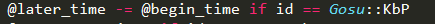
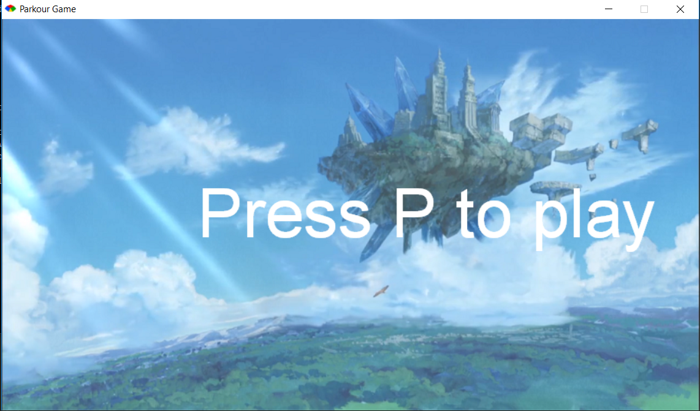
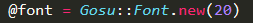
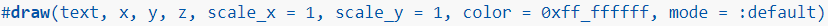
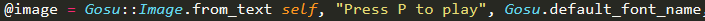

# Entry 7: Developing the MVP
I focused on developing my MVP this week. My parkour game still needs a lot more mechanics and features.

### Timer

I added a couple features to my MVP this week. One of which is the timer, which records the amount of time in seconds since the player started playing the parkour game.

The following code allows the timer to function properly. Both the `begin_time` and `later_time` start to increase as the game display window is called up. Then I manipulated the times to record the time in seconds after the player pressed P to start playing the game. This is only possible because of the `button_down` method in `gosu`.

### Changing the map

I added a couple things to the map. I added an end point indicated with a cave. I also added more symbols that correspond to the targeted tile. 

I added more tiles using a new tileset, including dark-color stone, light-color stone, cave, sand, and grass. This is accomplished using a new sprite sheet.

### Changing the font

I am able to change the color, size, and even the type of the font.

`@font.draw("<c=ffff00>yellow</c>", 10, 10, 1.0, 1.0, 1.0)`

The code above is placed in the `draw` instance method that runs 60 times a seconds by default. By using the `<c>` tag, I am able to change the color of the font with Hex codes.

The code above is placed in the `initialize` method that sets the font size for whatever that would be stored in `@font` to be 20.

The codes above are used to change the type of the font. One can possibly change the font by providing the font name.

## Takeaways
- **Things are much easier to accomplish with a set of plans.** I started the week by planninng what to add on to my parkour game, and I have a list of further development plans for the game. I had a clear sight of where my game was going, and the plans made it easier for me to focus on the coding part of my game.

## Next Step
- In order to make my parkour game look more professional, I will need a better character sprite sheet, which I tried to create one myself but ended up with something worse. I also have to add more features, such as NPC enemy-moving characters, player's health, damage, and more, to the game. 
