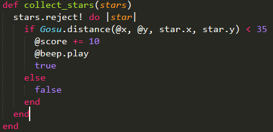
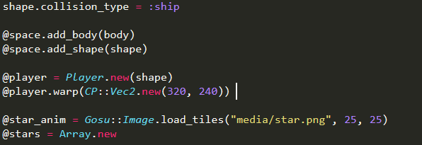

# Entry 8: Further Developing the `gosu` Project
Like I have mentioned in the previous entry's next step, I was going to focus on further developing my `gosu` project, the parkour game. So I, once again, focused on improving my `gosu` project this week.

### Collision

There are many things one can do with collision - when something collides with something else, do a certain action. A collision between two objects can be set as a trigger. 

For instance, when the avatar gets in touch with an enemy, reduces the avatar's health by 1. Another example would be when the avatar hits the end point, where the system would prompt the user with time spent. 

In order to be able to check the collision between two objects, I might have to know the coordinate of either one. Because the map is constructed using tiles, I need to know the coordinates to check collision.

I printed the x and y of my avatar to check the coordinate on top.

### Checking Collision Methods

There are multiple ways to check the collision between two objects. One is fairly simple and the other requires prior knowledge of `chipmunk`, which is a gem that allows us to do more stuffs with `gosu`.

Above is the simple way to check collision without using `chipmunk`. It is pretty much a plain ruby code, with some `gosu` concepts.

And this is the more complicated way to check collision using `chipmunk`.

### Chipmunk

`Chipmunk` allows one to do many things, it specifically has to do with game gravity and object collision. 

Below is an image of cubes falling down and hitting the static triangles in middle air. Once the cubes collide with the triangles, their falling direction vary depending on where they hit the triangles.

To simply explain `chipmunk`, it substitutes of instance variables such as @x, @y, and others with `body` and `shape`. They work in replacement of variables, making it easy to manipulate the attributes, whether it is the placement of the avatar or other stuffs. 

## Takeaways
- **The more practices you conduct, the better you are at it.** Although one's project might not be perfect and professional like many of the official websites, games, other stuffs out there, it is ok. Because no one can be an expert at something without conducting excessive amount of practices, and everyone starts off as a newbie and gradually becomes an expert.

## Next Step
- While it is certain that I have to continue working on improving my `gosu` project. I also have to worry about the presentation that is starting next week, thus, I have to think about what to do with the presentation and start creating presentation slides for my `gosu` project.